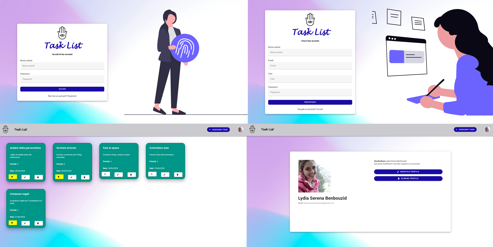

# Task List

Task List è un'applicazione web che consente agli utenti di gestire attività personali (task), con funzionalità di registrazione, login e operazioni CRUD sui task.



##  Funzionalità
- Registrazione utente (nome utente, email, password, foto profilo).
- Login con autenticazione tramite JSON Web Token (JWT).
- Creazione, visualizzazione, modifica ed eliminazione delle proprie task.
- Interfaccia utente reattiva sviluppata con Vuetify.

##  Stack Tecnologico
- **Frontend**: Vue.js + Vuetify  
- **Backend**: Node.js + Express.js  
- **Database**: MongoDB  
- **Autenticazione**: JSON Web Token (JWT)

Il progetto è stato sviluppato con la versione 22.14.0 di Node.js.

##  Installazione e avvio

### 1. Clonazione del repository
```bash
git clone https://github.com/YoussefBenbouzid/task-list.git
```

```bash
cd task-list
```

### 2. Installazione delle dipendenze
#### Root
```bash
npm install
```

#### Client
```bash
cd client
```

```bash
npm install
```

```bash
cd ..
```

#### Server
```bash
cd server
```

```bash
npm install
```

```bash
cd ..
```

### 3. Avvio di MongoDB
Attivare MongoDB; il database locale verrà popolato con due collezioni:
- `utenti`
- `task`

Nel file `.env`, specificare poi l'URI del database locale.

### 4. Configurazione delle variabili d'ambiente
Creare un file `.env` nella cartella server con il seguente contenuto:
```bash
PORT=5000
MONGODB_URI=mongodb://localhost:27017/<nome-database>
SECRET_KEY=<una-stringa-lunga-e-casuale>
```

### 5. Avvio del progetto
#### Root
```bash
npm run dev
```

Il progetto sarà disponibile al seguente indirizzo:
[http://localhost:3000](http://localhost:3000)
